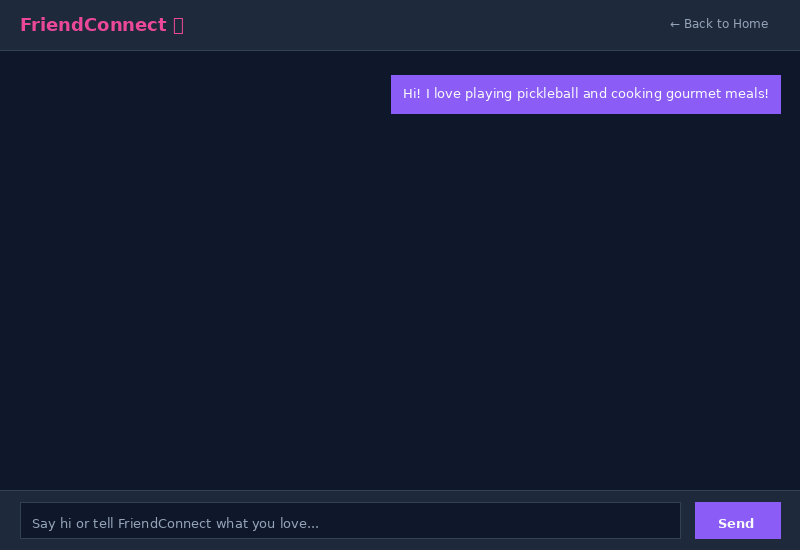
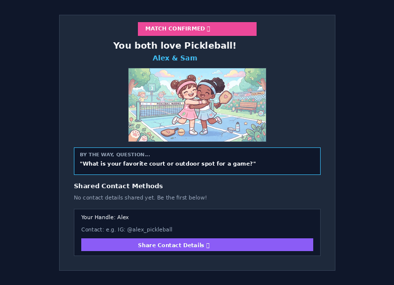
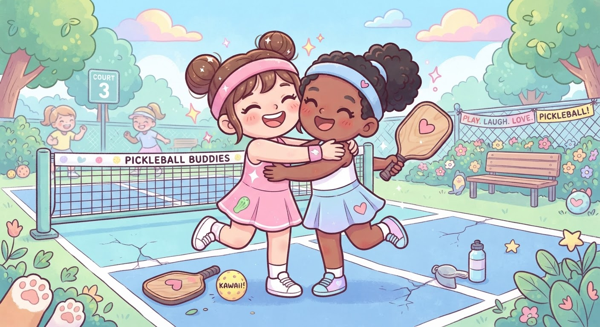
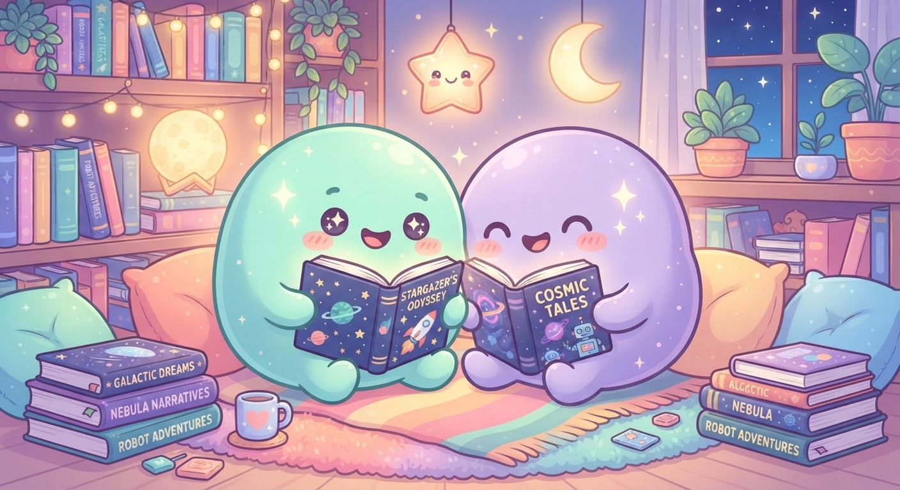

# FriendConnect Matchmaker Agent ✨

A state-aware conversational agent that guides users from intake to interest profile creation, discovers candidate friends using flexible match thresholds, and facilitates connections via unique live communication links featuring custom kawaii interest artwork.

## 🎬 Live Agent Demo & Interactive Flows

### 1. Agent Intake, A2UI Cards & Match Discovery


### 2. Live Pair Page & Real-Time Contact Exchange
When users click the pair link (`/match/<link_id>`), they arrive at a dedicated live page displaying their custom artwork, icebreaker question, and real-time contact exchange form:



---

## 🎨 Custom Generated Kawaii Match Artwork
When two users match on a shared passion (e.g. Pickleball or Reading), FriendConnect dynamically generates cute, personalized kawaii illustrations using Imagen & Gemini:

| Shared Passion: Pickleball 🏓 | Shared Passion: Reading & Literature 📚 |
| :---: | :---: |
|  |  |

---

## 🚀 Overview

**FriendConnect** is designed to solve the challenge of making meaningful, shared-interest connections. Rather than filling out dry forms, users engage in a natural conversation with FriendConnect. The agent analyzes their story, creates an interest profile, matches them with like-minded community members, and provides a shared live link for contact exchange.

---

## 🌟 Key Features

* **State-Aware Lifecycle Management**: Smoothly transitions through intake, discovery, matching, and rematch loops based on user conversational triggers (e.g. *"Find me friends"*, *"Find me another match"*).
* **Rich A2UI Display Cards**: Automatically renders structured A2UI cards for user interest profiles (showing top 3 interests + match score) and candidate match cards.
* **Custom Kawaii Artwork Generation**: Creates cute, heartfelt illustrations of friendly gender-neutral blob creatures enjoying their shared hobby together.
* **In-Chat Celebratory Banner**: Displays a celebratory header banner with the pair link, a quick-copy button, and an instant rematch button.
* **Real-time Contact Exchange UI**: Provides a dedicated, live Firebase-powered route (`/match/<link_id>`) where matched participants can exchange phone numbers, Instagram handles, or preferred contact details.
* **Demo Seeding Route**: Built-in `/api/demo/seed` endpoint for seeding candidate profiles across diverse interest categories.

---

## ☁️ Google Cloud & Vertex AI Architecture

FriendConnect leverages a modern suite of Google Cloud and Agent Development Kit (ADK) technologies:

| Capability / Tool | Description & Role |
| :--- | :--- |
| **Vertex AI Agent Runtime (ADK)** | Hosts and executes the core `root_agent` built with Python ADK 2.2+. |
| **Vertex AI Memory Bank** | Persists cross-session user preferences, state stage, and history. |
| **Google Cloud Firestore** | Stores user profiles, candidate pools, and real-time match documents. |
| **Google Cloud Storage (GCS)** | Public media bucket hosting generated kawaii interest artwork. |
| **Imagen / Gemini Image Gen** | Generates tailored 1:1 kawaii illustrations of shared hobbies. |
| **A2UI (Agent-to-User Interface)** | Emits structured JSON component surfaces (`a2ui-agent-sdk` v0.8) rendered natively in the Chat UI. |
| **Cloud Run & FastAPI** | Hosts the lightweight proxy server, chat UI, and match management routes. |

---

## 🔄 Conversation & Lifecycle Flow

1. **Intake Stage**: The agent warmly encourages the user to share their story, passions, and hobbies.
2. **Profile Creation**: Calculates interest vectors, saves the profile to Firestore, and presents an A2UI Profile Card.
3. **Discovery & Matching Stage**: Searches candidate profiles (threshold $\ge 0.50$).
   * If a match is found: Generates custom kawaii artwork, creates a match document, displays an A2UI Match Card, and shows the celebratory header banner.
   * If no match is found: Truthfully responds *"There's no match found. Let's try again later."*
4. **Rematch Loop**: Clicking *"Find me another match 🔄"* or asking for a new match smoothly resets the discovery state to find a new candidate.

---

## 🛠️ Local Development & Deployment

### Prerequisites
* Python 3.11+
* `uv` package manager
* `gcloud` CLI authenticated with GCP credentials

### Running Locally
```bash
# Install dependencies
uv sync

# Start frontend proxy locally
AGENT_ENGINE_RESOURCE_NAME="projects/517434892559/locations/us-east1/reasoningEngines/1114869606192775168" \
AGENT_DIRECTORY="app" \
PORT=8080 \
uv run python frontend/main.py
```
Open `http://localhost:8080` in your browser.

### Deploying to Cloud Run
```bash
gcloud run deploy friend-connect-frontend \
  --source ./frontend \
  --region us-east1 \
  --allow-unauthenticated \
  --set-env-vars "AGENT_ENGINE_RESOURCE_NAME=projects/517434892559/locations/us-east1/reasoningEngines/1114869606192775168,AGENT_DIRECTORY=app"
```

---

## 🧪 Testing

Run unit and integration tests:
```bash
uv run python -m pytest
```
